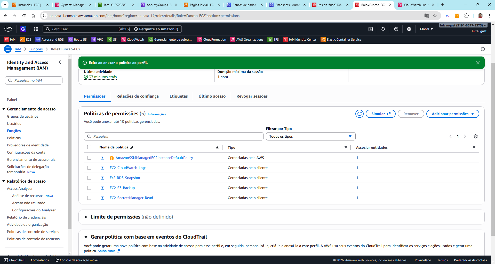
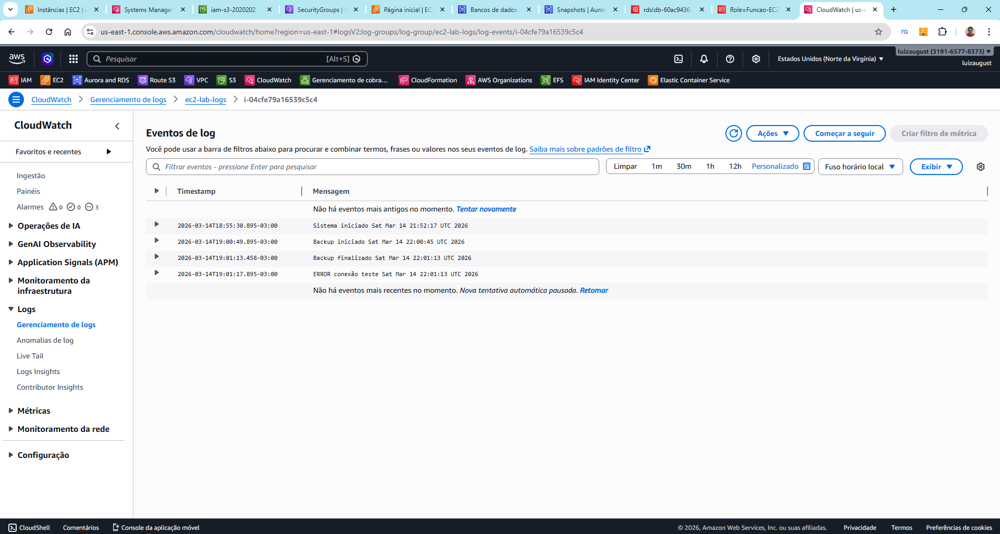
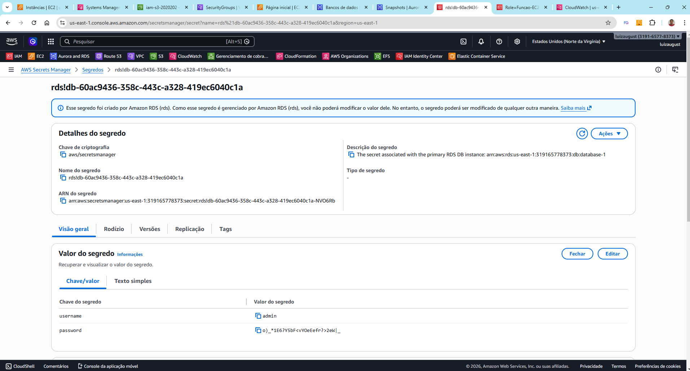
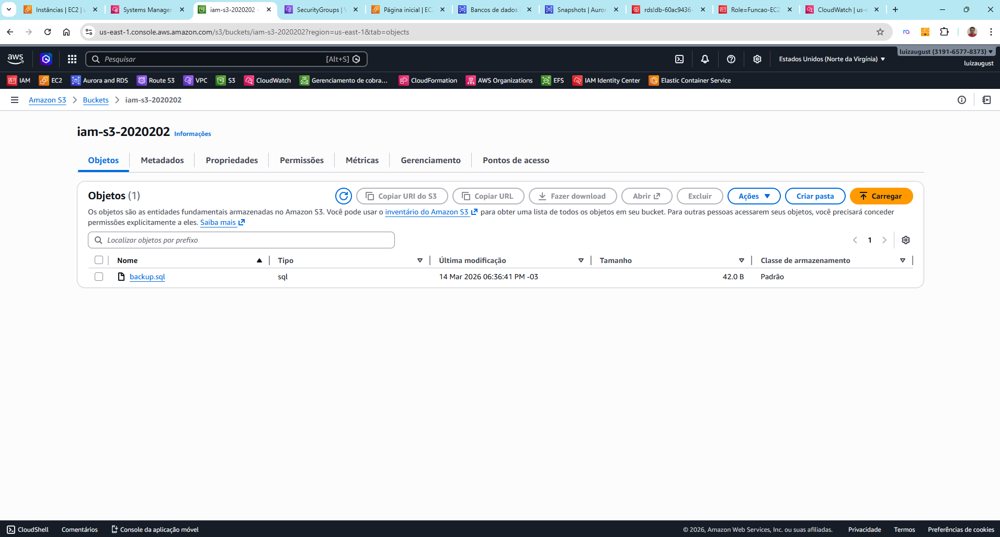
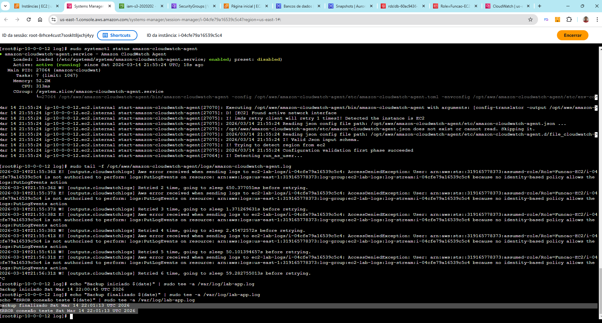
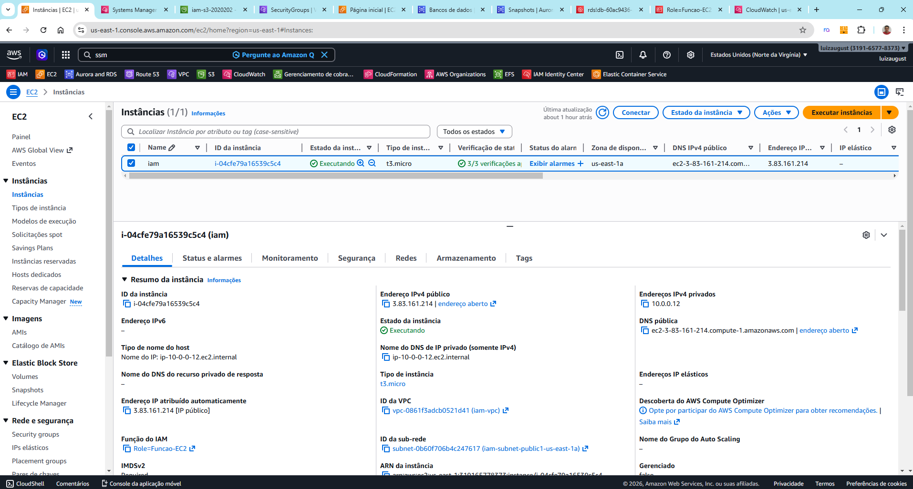
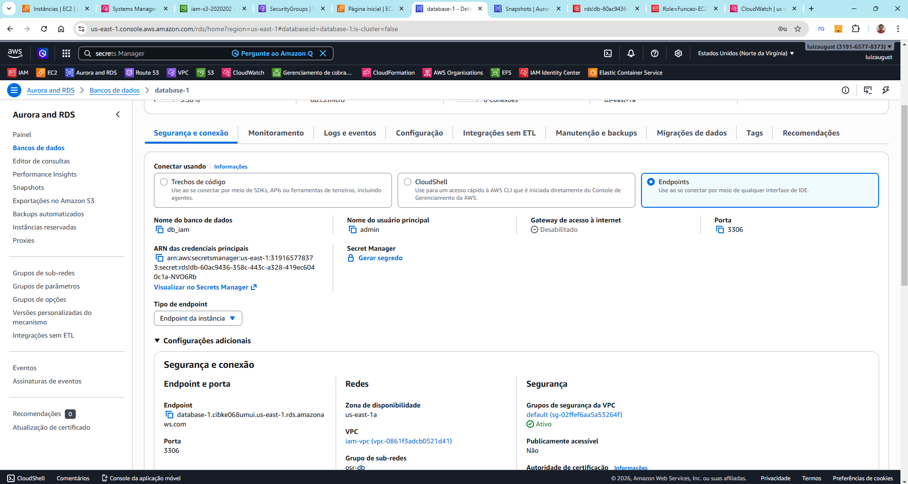

# 🚀 AWS IAM Lab -- EC2, RDS, Secrets Manager, S3, CloudWatch e SSM

## 📌 Sobre o Projeto

Este projeto demonstra na prática como utilizar **AWS Identity and
Access Management (IAM)** para permitir que uma instância **Amazon EC2**
acesse outros serviços da AWS de forma segura utilizando **IAM Roles e
Policies**, sem a necessidade de armazenar credenciais diretamente na
máquina.

O objetivo do laboratório é demonstrar como diferentes serviços da AWS
podem se integrar utilizando **boas práticas de segurança e arquitetura
cloud**.

Durante o laboratório foi criado um ambiente onde uma instância **EC2
Linux** acessa serviços como **RDS, Secrets Manager, S3 e CloudWatch**,
utilizando **IAM Roles e Policies personalizadas**.

.jpg)
------------------------------------------------------------------------

# 🧠 Arquitetura do Projeto

Serviços utilizados:

-   Amazon EC2
-   Amazon RDS (MySQL)
-   AWS IAM (Roles, Policies e Inline Policies)
-   AWS Secrets Manager
-   Amazon S3
-   Amazon CloudWatch Logs
-   AWS Systems Manager (SSM Session Manager)

Fluxo da arquitetura:

EC2\
↓\
IAM Role\
↓\
Secrets Manager\
↓\
Credenciais do banco\
↓\
RDS MySQL

EC2\
↓\
CloudWatch Logs

EC2\
↓\
Backup\
↓\
S3

------------------------------------------------------------------------

# ⚙️ Funcionalidades Demonstradas

### 🔐 Segurança e IAM

-   Criação de **IAM Roles**
-   Criação de **Policies gerenciadas**
-   Uso de **Inline Policies**
-   Aplicação do princípio de **Least Privilege**

### 💻 EC2

-   Instância Linux rodando aplicação
-   Acesso via **SSM Session Manager**
-   Uso da **IAM Role para acessar serviços AWS**

### 🗄️ Banco de Dados

-   Conexão entre **EC2 e RDS MySQL**
-   Recuperação segura da senha via **Secrets Manager**

### 📊 Monitoramento

-   Envio de logs para **CloudWatch Logs**

### 💾 Backup

-   Backup do banco enviado para **Amazon S3**

------------------------------------------------------------------------

# 📸 Fotos do Projeto

  
  
  

  
  
  

  

------------------------------------------------------------------------

# 🎥 Vídeo do Projeto

Veja o laboratório completo no YouTube:

https://youtu.be/e3mFQE_l6Cg

# 💼 Post no LinkedIn

Resumo do projeto publicado no LinkedIn:

https://www.linkedin.com/in/luiz-inhesta-341b4b311/

------------------------------------------------------------------------

# 🛠️ Tecnologias Utilizadas

-   AWS IAM
-   Amazon EC2
-   Amazon RDS
-   AWS Secrets Manager
-   Amazon S3
-   Amazon CloudWatch
-   AWS Systems Manager
-   AWS CLI
-   Linux (Amazon Linux)

------------------------------------------------------------------------

# 📚 Objetivo do Laboratório

Este laboratório foi criado para praticar conceitos fundamentais de
**segurança e integração de serviços na AWS**, simulando um cenário real
onde aplicações precisam acessar outros serviços da nuvem de forma
segura.

O projeto demonstra na prática como utilizar **IAM Roles e Policies**
para permitir que recursos da AWS se comuniquem sem expor credenciais.

------------------------------------------------------------------------

# 👨‍💻 Autor

**Luiz Augusto**

Profissional focado em **Cloud Computing, AWS e Infraestrutura**.

------------------------------------------------------------------------

# ⭐ Próximos Laboratórios

-   Automação com Terraform
-   Deploy com AWS CodePipeline
-   Arquitetura High Availability
-   Observabilidade com CloudWatch e Grafana
